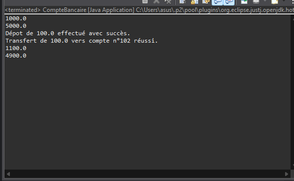
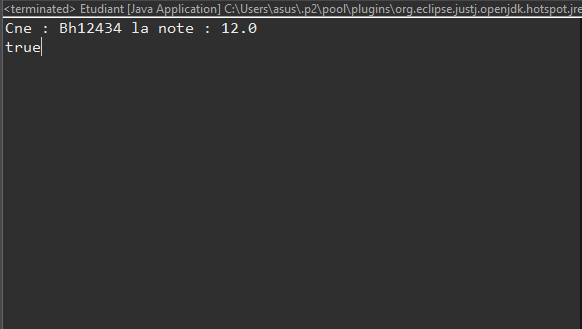
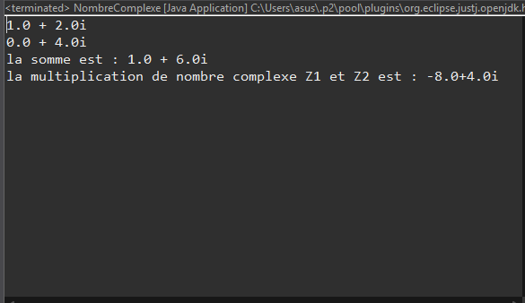
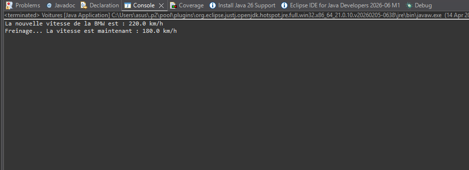
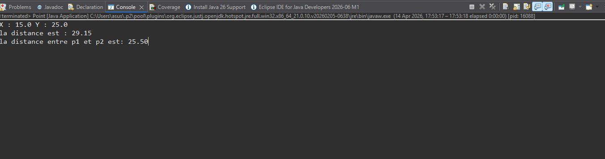
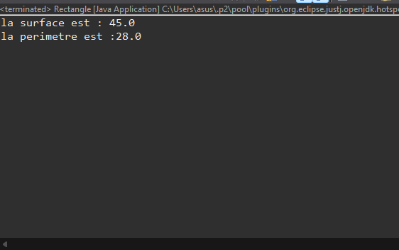
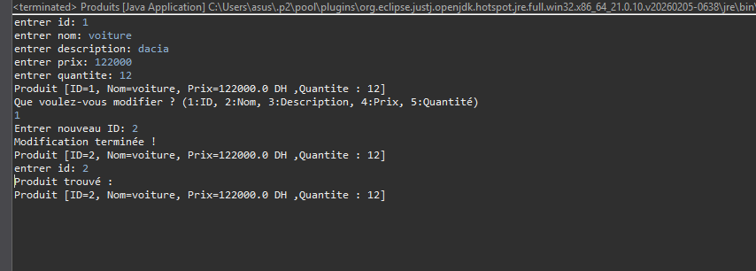
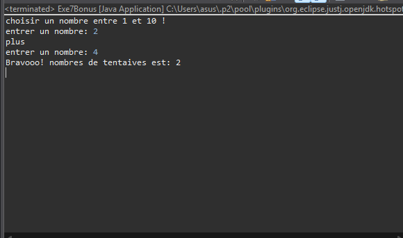

# Travaux Pratiques N°3 : Programmation Orientée Objet en Java

## Description
Ce dépôt contient les solutions des exercices du TP3, portant sur les concepts fondamentaux de la POO en Java (Classes, Objets, Constructeurs, et Méthodes).

## Liste des Exercices
Voici les captures d'écran des résultats (Outputs) pour chaque exercice :

### 1. Gestion de Compte Bancaire

### 2. Gestion des Étudiants

### 3. Opérations sur les Nombres Complexes

### 4. Gestion de Voitures

### 5. Manipulation de Points

### 6. Calculs sur le Rectangle

### 7. Gestion de Produits

### 8. Bonus / Exercice 7

---
## Structure du Projet
- **/java** : Contient les fichiers sources (.java).
- **/screenshots** : Contient les captures d'écran de l'exécution du code.
